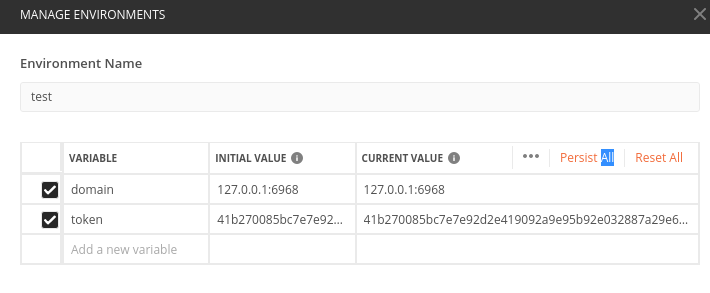
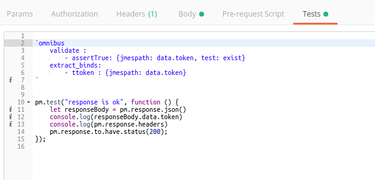

# Testing Using Postman JSON Collection

Omnibus supports automated testing using Postman JSON files. Unlike YAML test files, naming your Postman collection with **test_** prefix is not necessary.

There several things that you need to know before using Postmans colletion on omnibus:

--------------------

## Setting Up Environment

Postman's variables set up is parallel with our variable_binds. When you set an environment on your postman's test collection, omnibus will automatically bind it in test's  **configuration**. 

### Example:

Postman Variables Environment:




Omnibus will automatically convert those environement into :

```yaml
- config:
    - variable_binds: {'domain': '127.0.0.1:6968', token: '41b27008...' }

- test:
    - method: GET
    - url: { template : $domain/api/zone?Access-Token=$token}

```

For further information on Postman's environment and variables, see [documentation](https://learning.getpostman.com/docs/postman/environments_and_globals/intro_to_environments_and_globals/)


## Extraction and Validation

Currently there are no direct parser to execute Postman's test function, hence, you have to write extraction and validation manually on Postman's test script as shown below.

### Example:


Notice that omnibus will only read extraction and validation written inside javascript's template literals on YAML formats
```javascript
`omnibus
    validate: 
        - Your validation
    extract_binds:
        - Your extraction
`
```

## Further Reading

- Postman [Documentation](https://learning.getpostman.com/docs/postman/launching_postman/installation_and_updates/) 